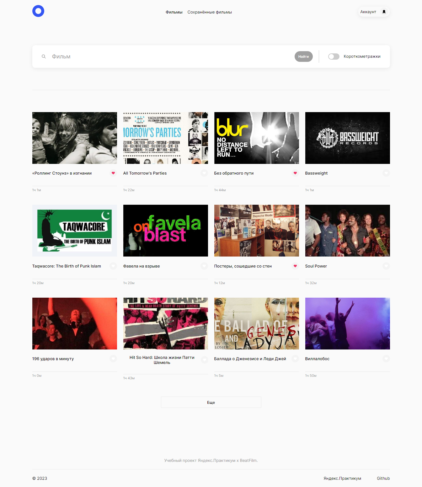
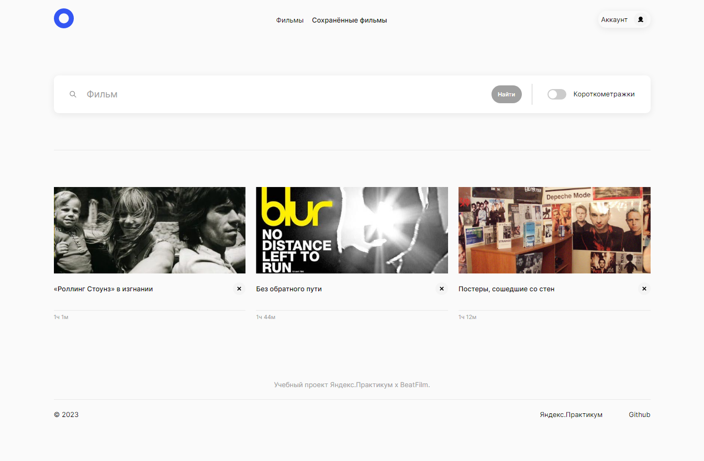
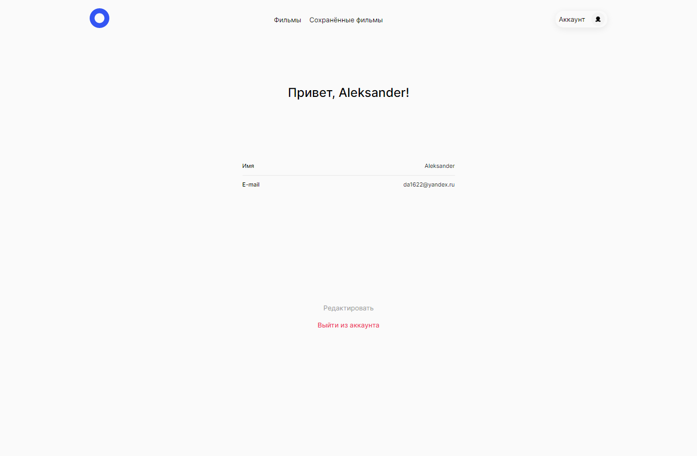
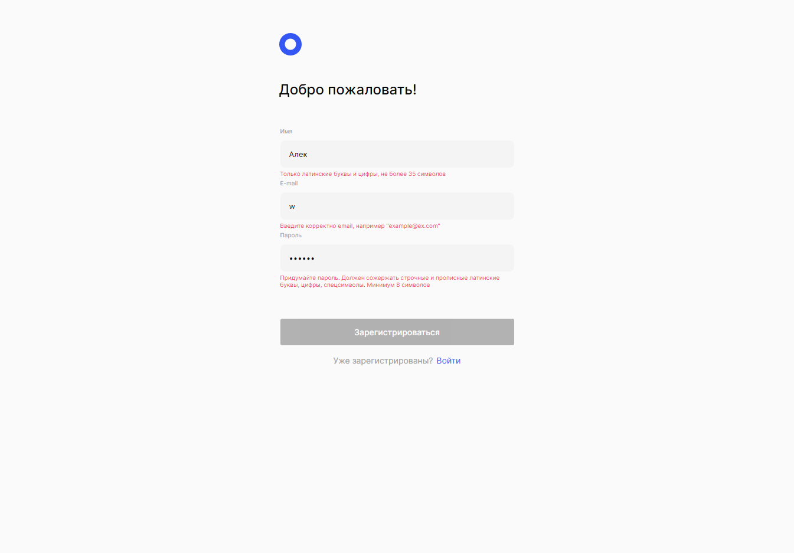

**[Проект: Кино исследователь](https://movies-hohlov.nomoredomains.rocks/signin)**

---

**Описание проекта:**

- вёрстка адаптивная: ширина зоны с содержимым меняется вместе с шириной окна браузера;
- реализовано с использованием React;
- файловая структура реализована по БЭМ;
- проект создан по макету Figma;
- реализован [backend проекта](https://github.com/Aleksandr-Hohlov/movies-explorer-api) с использованием Express.js и mongoDB;

**Реализован функционал:**

- редактирование профиля;
- поиск по фильмам;
- сохранение/удаление фьльма в "Сохраненные фильмы";
- регистрация и авторизация при входе;
- проверка вводимых данных на стороне клиента с помощью React useForm;
- добавление фильмов на страницу по конпке `Еще`;

---

**_https://movies-hohlov.nomoredomains.rocks/signin_**

---

